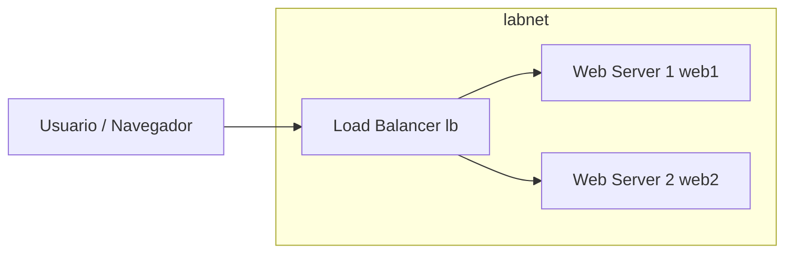

# Assignment 01 - Docker Balanceo de Carga (Round Robin) con Nginx
Daniel Fernando Ixcot Nimatuj 202308026

## Diagrama de la infraestructura

## Comando para ejecutar la infraestructura
docker compose up -d

## URL al link del balanceador
http://localhost:8080 
- Al recargar estara alternando entre web1 y web2